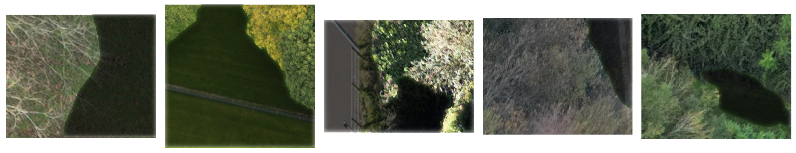

## UCC-AI-QUEST-2023

> Cork is blessed with breathtaking landscapes and serene greenery. This year, UCC AI Quest will focus on stunning aerial images of a high-resolution camera to recognise vegetation patches in Irish natural places... It includes the release of a new dataset of realistic drone images for benchmarking semantic segmentation from various above ground levels.


<!-- center align -->
<!-- source: [Competition page](https://aihub.ml/competitions/623) -->
<p align="center">
    Source:
    <a href="https://aihub.ml/competitions/623">
    competition page
    </a>
</p>

This repository contains the solution of team `FSGWL` (_i don't know what it stands for lmao_) for the [competition](https://aihub.ml/competitions/623).

---



Quick access to the inference notebook:
<a href="https://colab.research.google.com/github/nhtlongcs/ucc-ai-quest-2023/blob/main/notebooks/solution.ipynb">

</a>

By the way, we are one of the teams that achieved top places in the [leaderboard](https://aihub.ml/competitions/623#results), so feel free to ask us anything about the competition. The slides for the presentation can be found [here]() and the technical report can be found [here]().

## Install dependencies

Using conda, recommend mamba for faster solving time

```bash
conda env create -f environment.yml
conda activate ucc
```

## Setup data

By downloading the data from the competition, you agree to the competition's [terms and conditions](https://aihub.ml/competitions/623#learn_the_details-terms_and_conditions).

Unzip `*.zip` in data folder so it has the following structure

```
data/public/img/train
data/public/img/valid
data/public/ann/train
data/public/ann/valid
data/private/img/test
```

To ensure the data and the environment is setup correctly, run the following command. It should run without error

```bash
CUDA_VISIBLE_DEVICES=0 PYTHONPATH=. pytest tests/pkg/classics/
CUDA_VISIBLE_DEVICES=0 PYTHONPATH=. pytest tests/pkg/transformers/
```

## Usage

Join team using WanDB `https://wandb.ai/ucc-quest-23/`

```
$ ucc-train -c <config-file-path> -o <override_arg1>=<value1> <override_arg2>=<value2> ...
```

More details in `notebooks/train.ipynb`

```
$ ucc-pred -c <inference-config-file-path> -o <override_arg1>=<value1> <override_arg2>=<value2> ...
```

More details in `notebooks/make_submission.ipynb`

Some special flags:

-   `global.find_lr=True` : This will find the optimal learning rate for the config file, rerun when have minor change
-   `global.wandb=True`: In the training code include some visualize code using wandb, please not set this value to `False` in the trainning mode.

## Prepare results for submission

After training, the checkpoints are stored in folder `PROJECT_NAME/RUNID/checkpoints`. We need to prepare a file named "results.json" for submission on CodaLab. Use the notebook `notebook/make_submission.ipynb` and replace the checkpoint path

there should be a file `results.zip` generated in the `output` directory. You should be able to submit the file `results.zip` now.
